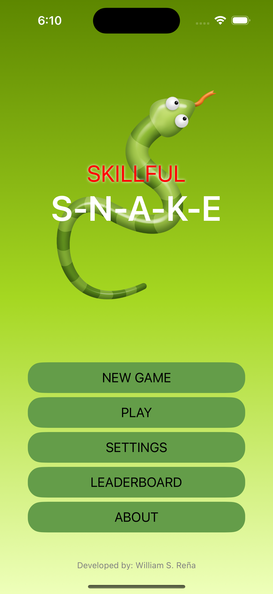
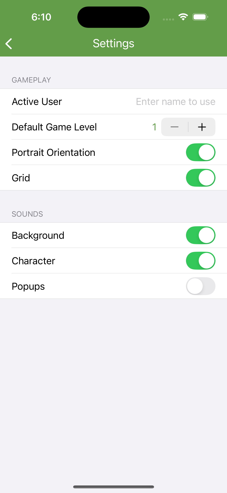
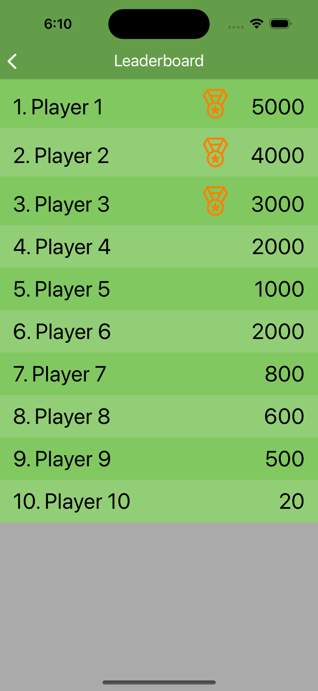
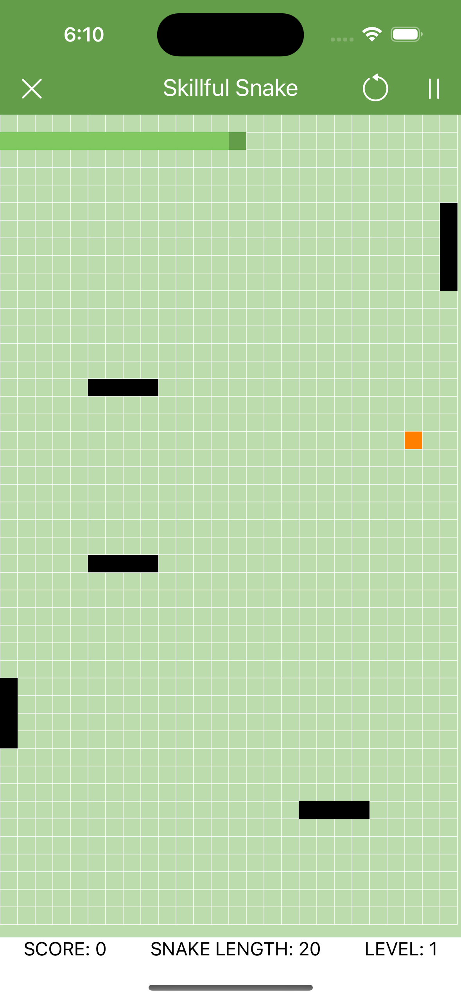

# Skillful Snake

Snake game built using **UIKit**. Our different way to study Swift Language.

## Featured List

1. Home
	- Leaderboard
	- Settings
	- About

2. Game
	- New Game / Continue
	- 2 Play mode (map based, casual)
	- Snake Collision (itself, obstacles)
	- Pause / Play / Restart
	- Timer Enabled Play
	- Swipe or Keyboard Gesture
	- Configurable

3. Game Levels
	- Custom Level Design via JSON file
	- Sound Effects (Eating, Collision, Background, Gameover)

4. Skills
	- Allow body collision (flexible body) - PENDING
	- Hard headed snake (can destroy obstacles) - PENDING

## GAME MECHANICS

- [Gameplay] Use can play either map-based (default) or casual from app settings.
- [Sound] Sound effects can be on/off from the app settings.
- [Sound] Sound effects for character (Eating, Change Direction), popups (Game Over, Level Up, Hiscore) 
- [Stage] A stage is cleared or completed if game is not over yet until time is up.
- [Score] User will earn stage points only if completed the stage. 
- [Snake] Snake will update it's length only if completed the stage.

## Technology

PROJECT SPECIFICATIONS

- **IDE:** `XCode 15.4 for iOS 17.5`
- **Language:** `Swift 5`
- **Interface:** `Storyboard`

## Technical Implementations

- MVVM + Combine
- Property Wrappers
- Custom Logger
- User Defaults
- Package Dependencies
	- [Eureka](https://eurekacommunity.github.io/) - iOS form builder
	- [SuperEasyLayout](https://github.com/doil6317/SuperEasyLayout) - apply UI constraints programmatically

## Screenshots

		
		
		
		
		
	
