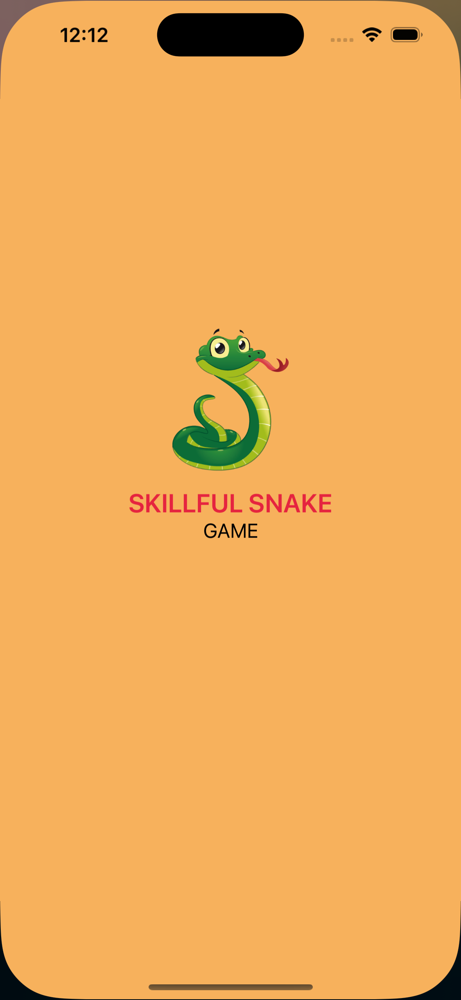
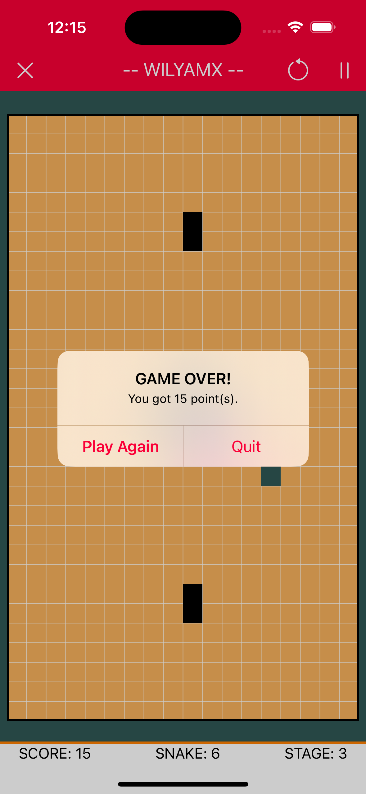

# Skillful Snake

Snake game built using **UIKit**. Our different way to study and explore iOS Swift Language.

## Featured List

1. Home
	- Leaderboard
	- Settings
	- About - PENDING

2. Game
	- New Game / Continue
	- 2 Play mode (map based, casual)
	- Snake Collision (itself, obstacles)
	- Pause / Play / Restart
	- Timer Enabled Play
	- Swipe or Keyboard Gesture
	- Configurable

3. Game Levels
	- Custom Level Design via JSON file
	- On/Off Sound Effects (Eating, Collision, Background, Gameover)

4. Skills
	- Allow body collision (flexible body) - PENDING
	- Hard headed snake (can destroy obstacles) - PENDING

## GAME MECHANICS

- [Gameplay] Use can play either map-based (default) or casual from app settings.
- [Gameplay] User will force to play casual game if unable to load game configuration file.
- [Gameplay] Save the user last game progress and continue to play.
- [Gameplay] Support both orientation in the game environment only.
- [Gameplay] Has the option to reset data
- [Leaderboard] Active user will be highlighted in the leaderboard to motivate increase ranking.
- [Leaderboard] Separate leaderboard map-based and casual play mode.
- [Leaderboard] User ranking will update every complete of the stage.
- [Score] User will earn stage points only if completed the stage.
- [Score] As the snake length increases the food credit also vary. 
- [Snake] Snake will update it's length only if completed the stage.
- [Snake] As the snake grows the speed increases.
- [Sound] Sound effects can be on/off from the app settings.
- [Sound] Sound effects for character (Eating, Change Direction), popups (Game Over, Level Up), background 
- [Stage] A stage is cleared or completed if game is not over yet until time is up.
- [Stage] Configurable either time-based or eat all spawn food item to clear the stage.

## Technology

PROJECT SPECIFICATIONS

- **IDE:** `XCode 15.4 for iOS 17.5`
- **Language:** `Swift 5`
- **Interface:** `Storyboard`

## Technical Implementations

- MVVM + Combine
- Coordinator Design Pattern for Navigations
- Property Wrappers
- Custom Logger
- User Defaults
- Target Schemes (Production and Development Environment)
- Package Dependencies
	- [Eureka](https://eurekacommunity.github.io/) - [iOS form builder](https://github.com/xmartlabs/eureka)
	- [SuperEasyLayout](https://github.com/doil6317/SuperEasyLayout) - apply UI constraints programmatically

## Screenshots

	
	
	
	
	

	
	
	
	
	
	

	
	
	
	

	
	
	
	

